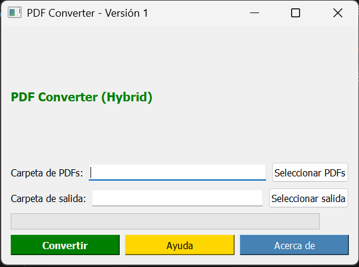
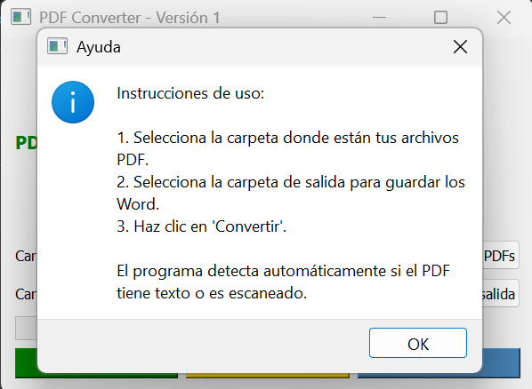
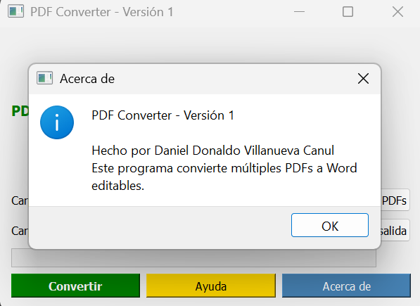

# 📄 Convert - PDF a Word Converter


**Versión 1.0**  
Hecho por **Daniel Donaldo Villanueva Canul**

---

## 🖼️ Capturas de pantalla

### Dashboard principal


### Instrucciones de uso


### Acerca de


---

## 🚀 Descripción

**Convert** es un programa que convierte múltiples archivos PDF a documentos Word editables.  
Detecta automáticamente si el PDF tiene texto o es escaneado:  

- 📑 **PDF con texto** → usa **pdf2docx** (mantiene formato).  
- 📷 **PDF escaneado** → usa **OCR con Tesseract** (extrae texto).  

---

## ✨ Características

- Interfaz gráfica profesional con **PyQt5**.  
- Barra de progreso para seguimiento de conversiones.  
- Botones de **Ayuda** y **Acerca de**.  
- Exportación a ejecutable (.exe) con **PyInstaller**.  
- Icono personalizado para el programa.  

---

## 📦 Instalación

1. Clona el repositorio:
   ```bash
   git clone https://github.com/VillanuevaDaniel22390538/convertidor-word-to-pdf.git

Instala dependencias: pip install -r requirements.txt

Ejecuta el programa: python convert.py

Uso
Selecciona la carpeta donde están tus archivos PDF.

Selecciona la carpeta de salida para guardar los Word.

Haz clic en Convertir.

El programa detecta automáticamente si el PDF tiene texto o es escaneado.

Descargas
Puedes descargar la última versión compilada en la sección de Releases del repositorio.
Incluye el archivo .exe listo para usar en Windows.

Licencia
Este proyecto está bajo la licencia MIT.
Puedes usarlo, modificarlo y distribuirlo libremente, siempre dando crédito al autor.

Créditos
Hecho con ❤️ por Daniel Donaldo Villanueva Canul

---